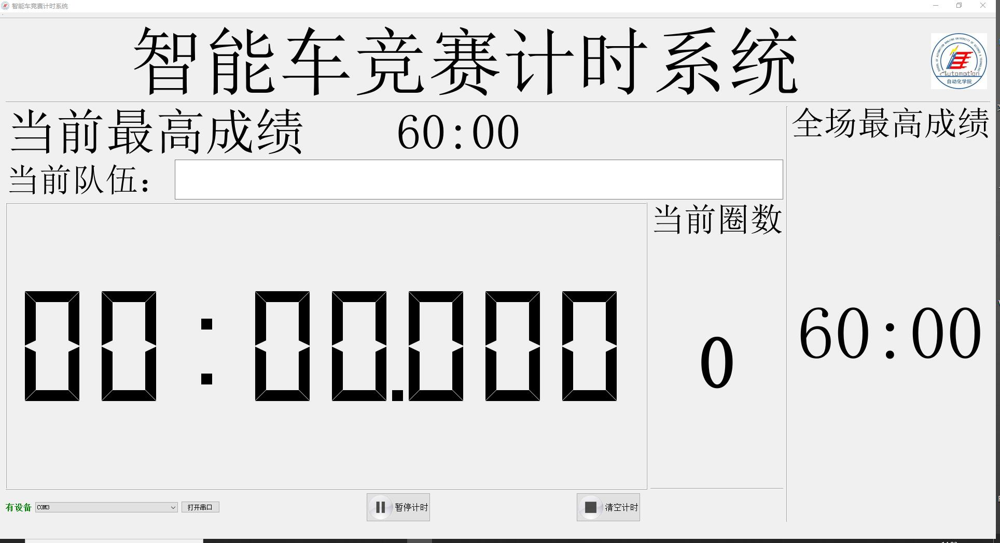

# 智能车竞赛简易计时系统
## 作者叨叨
* 由于系统过于简易，大家务必把所有的文字看完哈。
* 各位智能车选手多少都用过逐飞龙邱的计时系统，整个系统比较复杂，很难快速上手，而且平时测试以及校内赛用不上那么多功能，而且有一个问题就是，有一扭扭的贵，我们只是用来记个时嘛，没必要没必要。

* 恰巧之前我们这边也搞了一个校内赛，本来想搞龙邱的计时系统，结果到手硬件有点小问题，软件也没快速上手；于是乎换了逐飞，结果买迟了，来不及到货；所以死马当活马医，自己用Qt5肝了一个，简单易用十分方便。

* 校赛时的版本有个小bug，计时时间超过30s，总时间就会出现偏差，而且很大。[该版本测试视频](https://www.bilibili.com/video/BV1Vq4y1B7jW?spm_id_from=333.999.0.0)

* 2022-1-24闲来无事，修了一下bug，目前计时基本没有偏差，目前测试了1m30s，只有几毫秒的偏差，作为一个简易计时系统，我觉得可以忽略不计，大佬可以再修修，顺便给我update一下，提前感谢。[该版本测试视频](https://www.bilibili.com/video/BV1LS4y1Z7nH/)

* 软件截图如下： 

## 使用说明
* 使用前准备：准备好检测智能车的硬件设备（怎么准备后面说）
* 第一步：打开软件
* 第二步：在左下角选择串口并打开（注：串口是自动搜索，只要把设备插上去，就可以自动显示，选择相应的串口设备，点击打开即可）
* 第三步：在“当前队伍”文本框输入队名（也可以不输入，单纯就是让旁边的看客知道现在是哪个队伍，不输入也没关系Hhhhh；每换一次队伍名称，当前队伍最快成绩就会清零，方便记录每一队最好成绩，当然最右侧的整场比赛最优成绩不会变，如果要重置整场最优成绩，就得关掉软件重开orz）
* 第四步：发车起飞！
* 如果出现飞车、自己把车拿起来等情况，按照如下处理方式： 
  * 点击暂停计时，出现弹窗：是否计入成绩，选择否；如果选择是，则目前时间会update到最优成绩。
  * 然后点击清除时间，这个时候不仅将软件显示部分清零，也会给硬件设备发送一个清零信号，硬件设备也需要复位（详情参照后续的硬件设备说明）。

## 硬件设备准备
* 使用软件之间，必须要准备好硬件，要不然没有串口设备and串口设别不发送相应的命令，整个软件计时部分是不会启动的。
* 硬件设备构成大体如下：  
  * 一个随便什么的带串口的MCU（串口波特率115200）
  * 一个光电检测板 / 一个带运放的线圈（智能车屁股下面要装一个磁铁）
* 整体工作原理：检测装置检测到车辆，MCU就相应的发出信号
* 按照车辆正常发车，理想运行的情况下，装置发出的信号如下：  
  * 车辆从车库发车，检测装置检测到车辆，MCU通过串口发出“A\n”
  * 车辆运行一圈，第二次经过检测装置，MCU通过串口发出“B\n”
  * 车辆运行第二圈，回到车库，第三次经过检测装置，MCU通过串口发出“C\n”
* 如果出现飞车、自己把车拿起来等情况，MCU还在等待第二次、第三次的经过，从而发送B、C信号，为了重置MCU，在软件上需要点击清除计时按钮，此时软件将会给硬件设备发送串口信号“0\r\n”，从而使MCU计数重置。

## 结束语
* 这个系统真的是过于简易，甚至是简陋，但是感觉平时用足够了，欢迎各位在我这个模板上面魔改，只求大佬们魔改之后，可以update给我，我加入到github & gitee的分支里面，方便各位智能车小伙伴使用。
* 如果有同学看不明白，或者硬件设备搞不明白，欢迎联系我，联系方式在末尾；如果有小伙伴自己不是很会做硬件设备，可以找我帮忙制作，如果后续需要的同学比较多，可能会考虑出一个开源硬件，或者做一批供大家购买（成本价一定是，不搞韭菜行为）
* 最后的最后，欢迎大家一起交流软件问题and智能车问题
## 联系作者
* QQ：378099789
* Bilibili ID号：26149458 昵称：找寻着你呐
* 大家联系我的时候请大家表明来意，如果各位高兴的话，欢迎给我的B站一键三连加关注